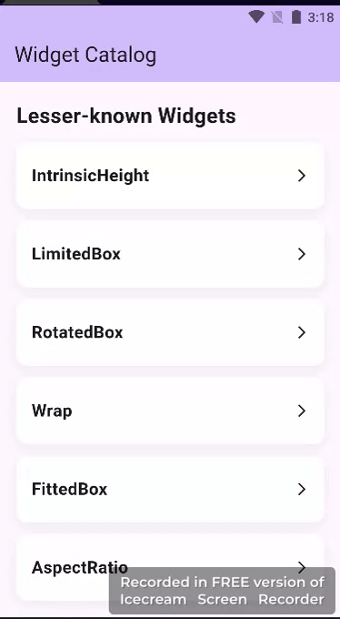

# widget_catalog_feature

Widget Catalog Mini App:
A Flutter mini app demonstrating a dynamic widget catalog.

⦁	Showcases lesser-known widgets (IntrinsicHeight, LimitedBox, RotatedBox).

⦁	Staggered animations for each item.

⦁	Moreover, each widget uses a unique animation combination: slide, fade, scale, rotation.

⦁	On the other hand, sections appear sequentially for clear focus.

⦁	Perfect for exploring Flutter animations and building interactive catalogs.
Here’s a quick demo of the app:

